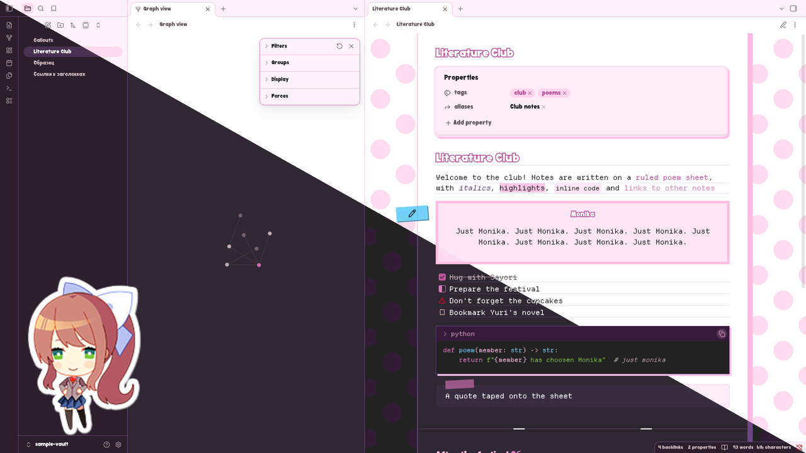
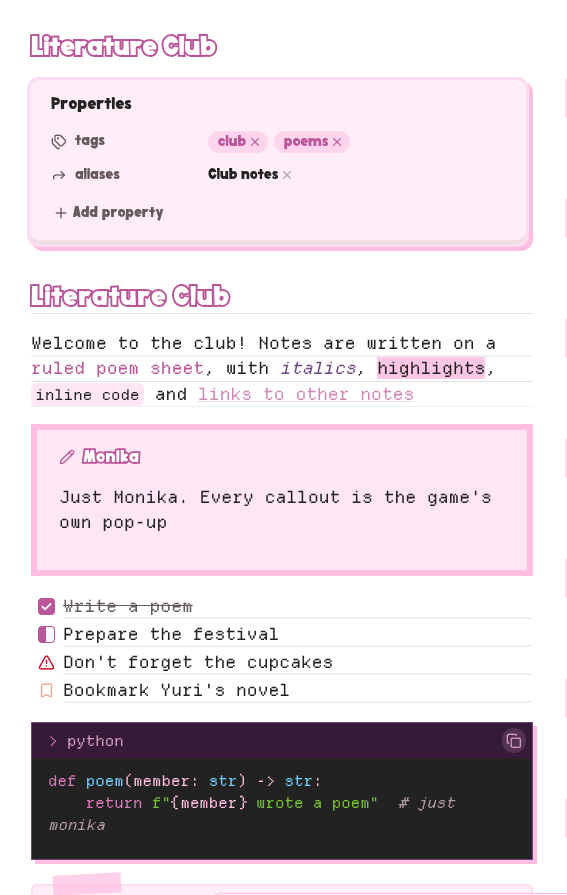
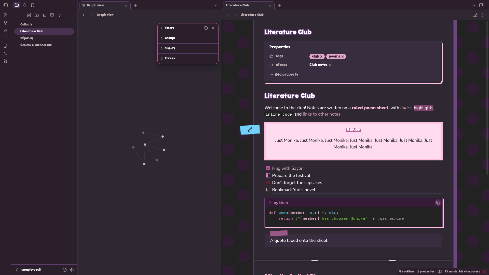
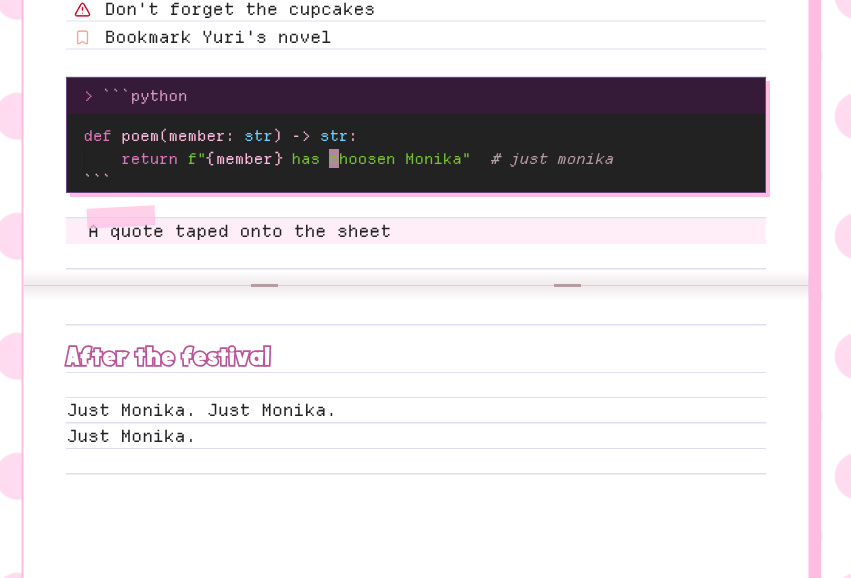
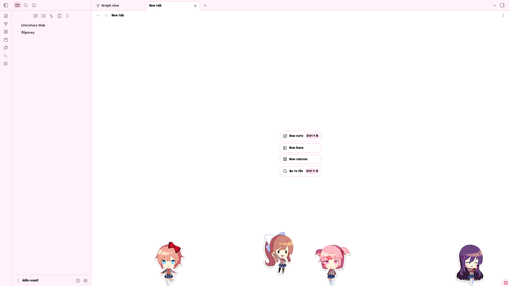

<div align="center">

# ddlc-obsidian-theme

**An Obsidian theme that looks like Doki Doki Literature Club: polka dots, poem sheets and the "Just Monika." pop-up, light and dark** （´ω｀♡%）


[](https://github.com/rokokol/ddlc-palette)
[](ASSETS.md)
[](LICENSE)
[](https://github.com/rokokol/ddlc-obsidian-theme/actions/workflows/build.yml)
[](https://github.com/rokokol/ddlc-obsidian-theme/actions/workflows/macos.yml)

</div>



The theme is called **DDLC** inside Obsidian. Its colours come from [ddlc-palette](https://github.com/rokokol/ddlc-palette) parsed from ddlc.moe, and the roles they play, from muted text to the code window's syntax, come from [ddlc-themes](https://github.com/rokokol/ddlc-themes). So a note reads in the same colours as the kitty, btop and web themes there and [ddlc.nvim](https://github.com/rokokol/ddlc.nvim)

|  |  |
| ------------------------------------------- | ----------------------------------------- |

## What it looks like

- A pink polka-dot background that slowly drifts, as on the game's menu, under a white poem sheet with faint ruled lines
- Headings lettered like the game's menu, white inside an outline
- Callouts drawn as the "Just Monika." pop-up with everything centred, and a sticker in the type's colour on the margin carries its icon, see [Callouts](#callouts)
- Properties on a signboard of their own, quotes as notes taped onto the sheet, and `---` as the fold of an exercise book
- Code blocks as small terminal windows in the colours of the kitty and nvim themes, with the language and a copy button in the title bar
- Icons for the task states most themes share, such as `[/]`, `[!]`, `[?]` and `[b]`
- The dark variant keeps the same club on a muted violet sheet, and the pop-ups stay pale on it
- Motion stops when the system asks for reduced motion

Headings use the game's `Doki` font where it is installed; the theme does not ship it, see [ASSETS.md](ASSETS.md)



## Install

Download `theme.css` and `manifest.json` from the [latest release](https://github.com/rokokol/ddlc-obsidian-theme/releases/latest) into `.obsidian/themes/DDLC/` inside your vault, then pick **DDLC** under **Settings → Appearance → Themes**

## The club on an empty tab



An optional snippet puts the four girls at the foot of every empty tab, as on the [ddlc-sddm-theme](https://github.com/rokokol/ddlc-sddm-theme) login screen. They walk to and fro, hop now and then, and hop when the cursor touches them

To turn it on, download `ddlc-stickers.css` from the same [release](https://github.com/rokokol/ddlc-obsidian-theme/releases/latest) into `.obsidian/snippets/` inside your vault, then enable it under **Settings → Appearance → CSS snippets**. It works with the DDLC theme and with any other

It is a snippet and not a part of the theme for these reasons:

- The stickers are Team Salvato's artwork, while the theme itself draws everything in CSS and carries no official image. Keeping them apart lets the theme in the community directory stay free of game assets, and lets you choose whether you want them, see [ASSETS.md](ASSETS.md)
- The girls move all the time, and not everybody wants motion on an empty tab
- The pictures are embedded in the file, so the snippet is several times larger than the theme

## A still background

The drifting dots keep Obsidian drawing a new frame on every screen refresh while a note is on screen, which costs some battery on a laptop. The optional `ddlc-still.css` snippet from the same [release](https://github.com/rokokol/ddlc-obsidian-theme/releases/latest) stops the drift and leaves the dots in place. Install it the same way as the stickers. It has an effect only with the DDLC theme

## Build

`theme.css` is generated, and each release carries one built from its own sources. Its colours and icons come from copies of other repositories kept in `vendor/`, and only `src/ddlc.css` is written by hand

```sh
./generate.sh build           # render theme.css
nix develop -c ./check.sh     # the gate CI runs
```

`./generate.sh help` and `./check.sh help` describe the rest
